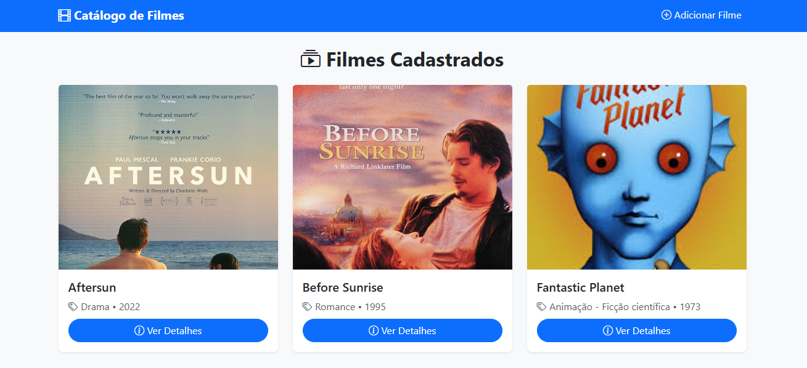
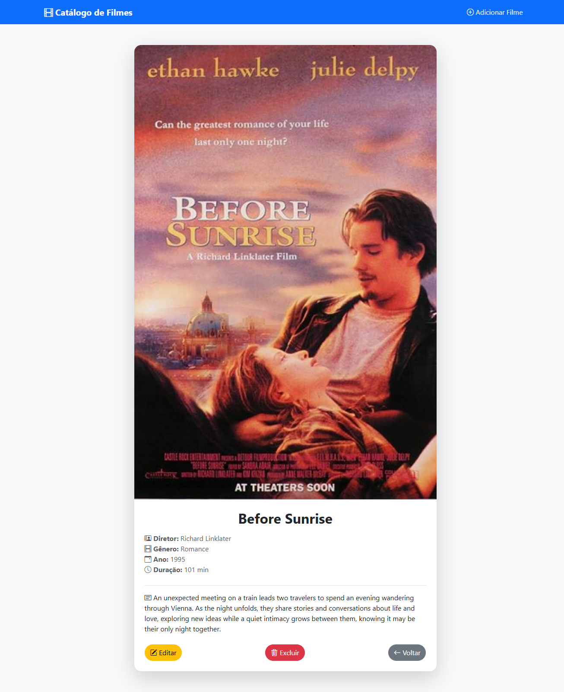
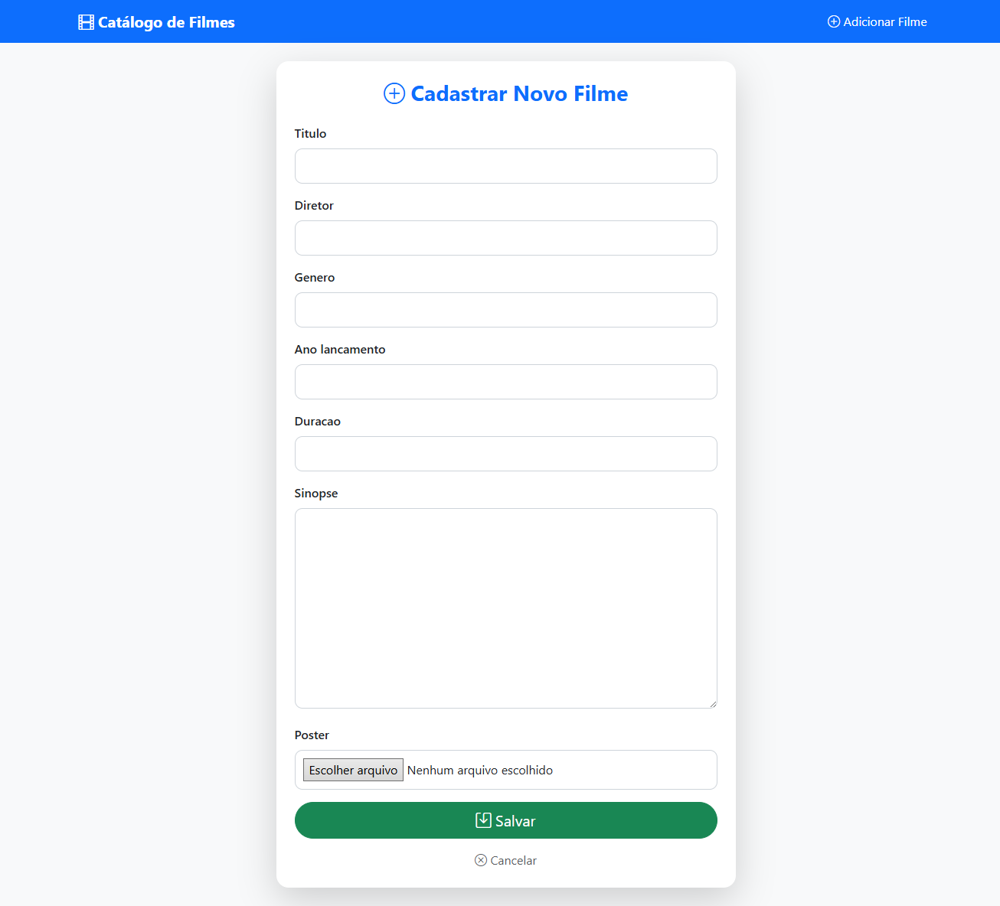
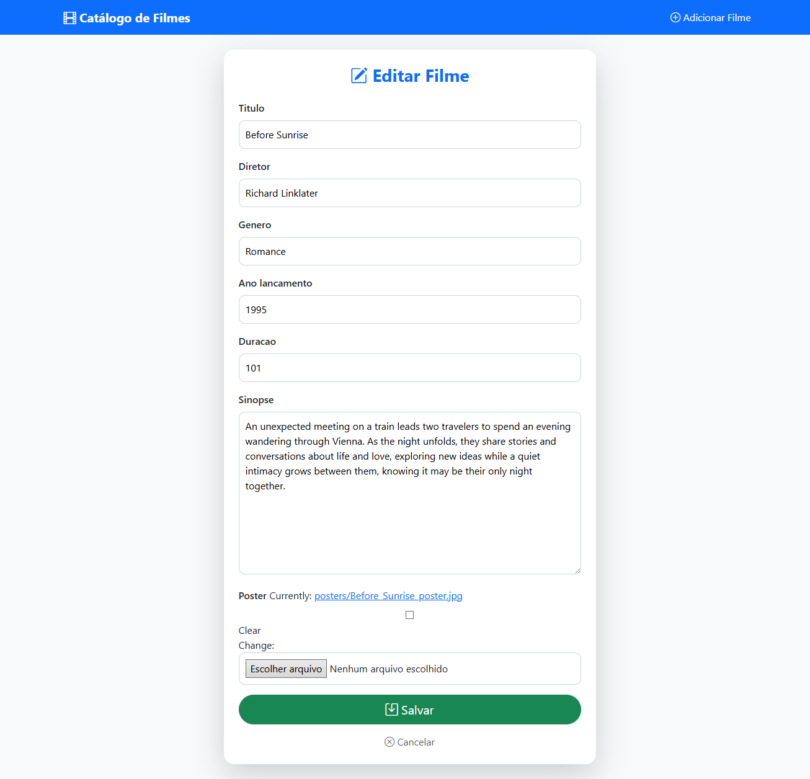
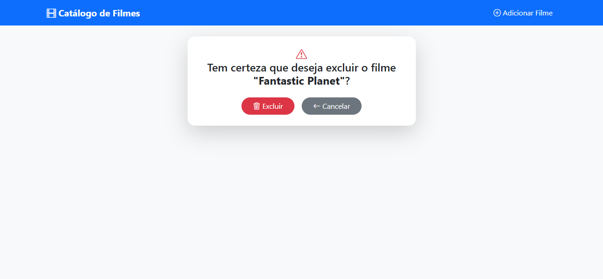

# Sistema de catalógo de filmes utilizando CRUD com Class Based Views

## Funcionalidades
- Listagem de filmes
- Adição, edição e exclusão de filmes
- Detalhamento de cada filme

## Rotas principais
- `/` -> Lista de filmes 
- `/filmes/<id>/` -> Detalhes de um filme 
- `/criar/` -> Adicionar novo filme 
- `/editar/<id>/` -> Editar filme já cadastrado 
- `/deletar/<id>/` -> Excluir filme 

## Telas
- Listagem 

- Detalhes

- Adicionar 

- Edição 

- Deletar 
